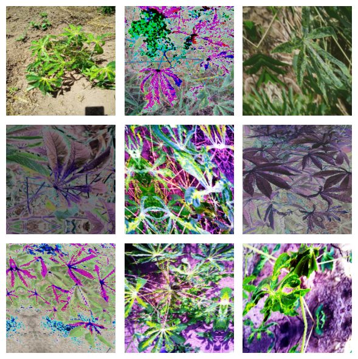

# Compitiendo en Kaggle: El Arte de Diagnosticar enfermamdes en plantas de Yuca con KerasCV (Keras Community Day) 🤓🚀

  

Note: This repository is for the Keras Community Day 📄

## How to use it? 📦
Just click on Open in Colab, and you are going to have access to all the project.

## Yuca Algorithm :space_invader: 
As the second-largest provider of carbohydrates in Africa, cassava is a key food security crop grown by smallholder farmers because it can withstand harsh conditions. At least 80% of household farms in Sub-Saharan Africa grow this starchy root, but viral diseases are major sources of poor yields. With the help of data science, it may be possible to identify common diseases so they can be treated.

Existing methods of disease detection require farmers to solicit the help of government-funded agricultural experts to visually inspect and diagnose the plants. This suffers from being labor-intensive, low-supply and costly. As an added challenge, effective solutions for farmers must perform well under significant constraints, since African farmers may only have access to mobile-quality cameras with low-bandwidth.

  

## Dataset 📖
In this competition, we introduce a dataset of 21,367 labeled images collected during a regular survey in Uganda. Most images were crowdsourced from farmers taking photos of their gardens, and annotated by experts at the National Crops Resources Research Institute (NaCRRI) in collaboration with the AI lab at Makerere University, Kampala. This is in a format that most realistically represents what farmers would need to diagnose in real life.

Your task is to classify each cassava image into four disease categories or a fifth category indicating a healthy leaf. With your help, farmers may be able to quickly identify diseased plants, potentially saving their crops before they inflict irreparable damage.

[Kaggle Competition](https://www.kaggle.com/competitions/cassava-leaf-disease-classification/overview)

## Built with 🛠️
[TENSORFLOW](https://www.tensorflow.org/) - TensorFlow is an end-to-end open source platform for machine learning. It has a comprehensive, flexible ecosystem of tools, libraries and community resources that lets researchers push the state-of-the-art in ML and developers easily build and deploy ML powered applications.

[KERAS](https://keras.io/)  - Keras is a high-level neural networks API, written in Python and capable of running on top of TensorFlow, CNTK, or Theano. It allows for easy and fast prototyping, supports both convolutional networks and recurrent networks, and runs seamlessly on CPU and GPU. With its user-friendly and modular design, Keras empowers developers and researchers to build and experiment with complex machine learning models effortlessly.

## Authors 🖥
Created by: **Usha Rengaraju** [UshaRengaraju](https://github.com/ushareng)

Modified by:  **Adonai Vera** - *Machine Learning Enginner [Subterra AI](https://www.subterra.ai/)* - [AdonaiVera](https://github.com/AdonaiVera)

## Expressions of Gratitude 🎁
* Tell others about this project 📢
* Give thanks publicly 🤓.
